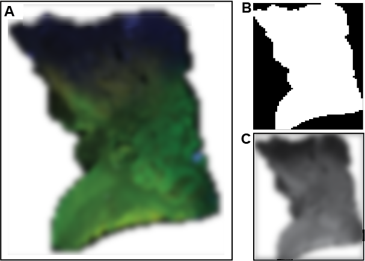

# HCCMiner

HCCMiner is a SciXMiner toolbox to analyze muliplex 2D fluorescence microscopy image data.

## Prerequisites
The HCCMiner toolbox is an extension of the MATLAB toolbox SciXMiner [1] and assumes SciXMiner is properly installed on your system. Moreover, HCCMiner uses the third party tool XPIWIT [2] for segmentation in the DAPI channel that also has to be installed prior to using the software. Precompiled binaries of XPIWIT for different operating systems can be downloaded [here](https://bitbucket.org/jstegmaier/xpiwit/downloads/). Precomputed projects don't need the XPIWIT software.

After having installed these requirements, download the HCCMiner toolbox and copy it into the application_specials folder of SciXMiner. Start SciXMiner using the command `scixminer` and enable the toolbox using *Extras -> Choose application-specific extension packages...*. Restart SciXMiner and you should see a new menu entry called HCCMiner.

To be able to use the external tool XPIWIT from within the toolbox (required to import new projects), SciXMiner has to be provided with the paths to the third party software that should be used for processing. The paths can be set using the menu entry *HCCMiner -> Import -> Set External Dependencies*. In particular, this is the path to the executable of XPIWIT (e.g., `D:/XPIWIT/Bin/`).

## Data Import
To properly import the project several details on the acquisition are required from the TissueFAXSViewer. This includes the grid size of acquired tiles (*e.g.*, 49x96). Moreover, an overview image of the entire plate is required (Fig. 1A). Note that the background should be set to white and the foreground should be densely covered either with black (empty) tiles or with fluorescent signal. To avoid holes, it makes sense to activate all fluorescent channels in the preview window of TissueFAXSViewer. Remaining holes can also be corrected using the GUI. The overview image will be converted to a binary mask later on and cropped/downsampled to the specified grid size to assist the correct tile assignment (Fig. 1B).

In addition to the overview image, a table containing the project information is required. This should be a Microsoft Excel file with one sheet. The sheet should contain one row per slide with the following 11 columns:

1. Tissue Type (e.g., Colon, HCC, ...): Used as identifier of the project.
2. Data Set Name (e.g., A, B, C, D, ...): Used as identifier of the project.
3. Data Set Code (e.g., 16-12678, ...): Used as identifier of the project.
4. Grid Layout ("R;C"): The grid layout of the sampling strategy (listed in TissueFAXSViewer as *FOV Matrix Size*)
5. Image Size ("W;H"): The width and height of each image tile (listed in TissueFAXSViewer as *FOV Size Pixels*).
6. Overlap ("overlapX;overlapY"): Number of overlapping pixels for neighboring tiles (listed in TissueFAXSViewer as *Overlap Size in Pixels*)
7. Pixel Size: The physical size of a pixel as floating point number (listed in TissueFAXSViewer as *Pixel Size(µm)*)
8. Numer of FOVs: The number of field of views (listed in TissueFAXSViewer as *Number of FOVs*).
9. Fill Holes: Set to 0 by default.
10. Input Folder: Folder containing the raw image information (e.g., `D:\Data\MultiplexHCC\XXX\MyDataSet CD69CD39CD8CD3CD4\Images\Slide 2 Colon 16-19261\Region 002`).
11. Overview Image Path: Absolute path to the overview image (e.g., `D:\Data\Projects\2021\MyProject_TissueClassification\Data\MyDataSet\MyDataSetA_16-19261.png`).

To start processing the data, use the menu command *HCCMiner -> Import -> Import New Experiment*. The script will ask for an Excel file containing the project information (see paragraph above) and for an output path where the extracted results should be written to. In the first iteration of import, select *Perform Consistency Check* to perform a consistency check to see if all tiles are available and that the provided mask images match the number of tiles. This is crucial to be able identify the correct sampling pattern of the tiles. If there are holes in the masks, the script asks you for input. On the figure that pops up, simply circle the missed pixels with the mouse to add the missing pixels to the mask. The correction can also be performed in multiple steps if you don't select all pixels at once, just do it in the next iteration. The loop will exit as soon as the number of tiles in the mask matches the expected number of tiles expected from the project description. As soon as all masks are correct, you can start the batch import by calling *HCCMiner -> Import -> Import New Experiment* again an this time selecting *Start Batch Processing*. Note that the processing may take a while (up to 1-2 hours per slide). After the processing finished, each line of the Excel file should have a separate folder. In each of these folders you should see a `*.prjz` file that is a SciXMiner project and contains all previously extracted information.

## Data Analysis
Start SciXMiner by calling `scixminer` from the MATLAB command prompt. Use *File -> Load Project* and select the `*.prjz` file of the project you want to analyze. Data is represented as a 2D table (variable name in MATLAB is `d_org`), where the first dimension is the data point id and the second dimension is the extracted feature. Each row thus corresponds to a feature vector of a single detected nucleus. Use the dropdown menu in the main window of SciXMiner and select *Single features* to see an overview of all extracted features. The view should look similar to the figure below:

You can now start selecting features you're interested in an visualize them via *HCCMiner -> Show*. This involves visualizations of heatmaps, boxplots, histograms and 3-color superposition images.

1. *Heatmaps*: Each detection is plotted as a point. Color-code corresponds to the selected feature value. Due to the 
2. *Boxplot*: Show a boxplot of the selcted feature. If you have a classification of, e.g., Tumor vs. Healthy Region you can select the output variable using the dropdown menu *Selection of output variable*. The visualization will then be separated for the different classes.
3. *Histogram*: Show a histogram of the selected feature. If you have a classification of, e.g., Tumor vs. Healthy Region you can select the output variable using the dropdown menu *Selection of output variable*. The visualization will then be separated for the different classes.
4. *3-Color-Superposition*: Requires three selected single features and draws a heatmap. Each feature is used as a separate color channel, i.e., red components represent the first feature, green components the second feature and blue components the third selected feature.

Note that all SciXMiner functionality that can deal with single features can also be applied to HCCMiner projects. This involves visualization, statistical testing, machine learning and many more.

## HCCMiner Settings
Use the main dropdown menu to navigate to the HCCMiner settings pane. This allows you to specify additional parameters to affect the plotting and processing behavior of HCCMiner:

The available settings are:
- *Neighborhood Radius*: The neighborhood radius (measured in pixel) used to extract neighborhood-related features like density and standard deviation.
- *Num Histogram Bins*: The number of histogram bins used for plotting histograms.
- *Quantile Threshold*: If `t` is larger than 0, it will be used as quantile normalization threshold. For instance, setting it to `5` would clip 5% of the data points at the bottom and top end of a feature range.
- *Scatter Plot Step Size*: Step size used for scatter plot visualizations. Setting it to `1` plots all points. Setting it to larger values, e.g., `2` will only plot every second point.
- *AF Correction Method*: Method used for removing the autofluorescene. 0: Do nothing, 1: fit Gaussian distribution and use mean+2*std as threshold, 2: search histogram mode and mirror the left part for removal.
- *AF Correction Multiplier*: Multiplier for the std. dev. if Gaussian-correction is used, else multiplier for the histogram mode.
- *AF Correction Min Threshold*: Minimum threshold that is used if auto-threshold is below this value.
- *Num Expression Classes*: Single feature values above the auto-fluorescence threshold will be split into this number of classes plus one background class for everything below the auto-fluorescence background.
- *Create New Figure?*: If enabled, each plotting command will open a new figure. If disabled, one can e.g., submit a figure handle to the plotting functions, which is useful for automated batch plotting.
- *Use Quantile Normalization for Plotting?*: If enabled, the *Quantile Threshold* is also applied for the plotting commands. Enable, e.g., if the visual appearance is dominated by a few very bright outliers.

## Additional Features
HCCMiner also offers the possibility to extract derived features from the preexisting ones. Currently, the following features are implemented:

- *Compute Density Feature*: Counts the number of neighbors in a radius specified by the parameter *Neighborhood Radius* (see settings dialog above).
- *Compute Num Active Neighbors*: Counts the number of active neighbors, i.e., cells that have an expression level above the auto-fluorescence.
- *Compute Variance Features*: Computes the standard deviation of a selected feature in a radius specified by the parameter *Neighborhood Radius* (see settings dialog above).
- *Compute Cleaned Expression Features*: Performs auto-fluorescence removal using the specified AF correction method (see settings dialog above).
- *Compute Principal Components*: Computes the principal components for the selected features and adds them as new feature channels. Can be useful to disentangle correlated features.
- *Rename Markers*: Rename the acquisition markers with the appropriate medical terms.

## References
1. Mikut, R., Bartschat, A., Doneit, W., Ordiano, J. Á. G., Schott, B., Stegmaier, J., ... & Reischl, M. (2017). The MATLAB Toolbox SciXMiner: User's Manual and Programmer's Guide. arXiv preprint arXiv:1704.03298.

2. Bartschat, A., Hübner, E., Reischl, M., Mikut, R., & Stegmaier, J. (2016). XPIWIT—an XML Pipeline Wrapper for the Insight Toolkit. Bioinformatics, 32(2), 315-317.
